# Apache NetBeans Language Server Extension for VS Code

<!--

    Licensed to the Apache Software Foundation (ASF) under one
    or more contributor license agreements.  See the NOTICE file
    distributed with this work for additional information
    regarding copyright ownership.  The ASF licenses this file
    to you under the Apache License, Version 2.0 (the
    "License"); you may not use this file except in compliance
    with the License.  You may obtain a copy of the License at

      http://www.apache.org/licenses/LICENSE-2.0

    Unless required by applicable law or agreed to in writing,
    software distributed under the License is distributed on an
    "AS IS" BASIS, WITHOUT WARRANTIES OR CONDITIONS OF ANY
    KIND, either express or implied.  See the License for the
    specific language governing permissions and limitations
    under the License.

-->
[](https://marketplace.visualstudio.com/items?itemName=ASF.apache-netbeans-java)
[](https://marketplace.visualstudio.com/items?itemName=ASF.apache-netbeans-java)
[](https://ci-builds.apache.org/job/Netbeans/view/vscode/job/netbeans-vscode/)
[](https://github.com/apache/netbeans/blob/master/LICENSE)

**Version 21.9.9 is 22.0 Early Access version.**

This is [Apache NetBeans](http://netbeans.org) Language Server extension for VS Code. Use it to get all the _goodies of NetBeans_ via the VS Code user interface! Runs on __JDK11__ and all newer versions.

Apache NetBeans Language Server brings full featured Java development (edit-compile-debug & test cycle) for Maven and Gradle projects to VSCode. As well as other features.
## Getting Started
1. Set JDK in `VSCode | Preferences | Settings ...` __Netbeans: Jdkhome__ setting to point to JDK which Language Server will run on and projects will be compiled with. More below in section [Selecting the JDK](#selecting-the-jdk)

2. Use __Java: New Project...__ " command to start creating new project, or
3. Open the folder with existing __pom.xml__ for Maven or ___Gradle___ project files (_build.gradle, gradle.properties_).
    *  Language Server opens the project, performs priming build and might ask for Resolving problems, usually related to opening 
    subprojects etc.
4. Or simply create a new Java class file with `public static void main(String[] args)` method in opened folder and start coding, compiling, debugging. Works on JDK 8 and newer.

## Proxy Issues
When running this extension on GraalVM, as its runtime JDK, behind proxy it requires GraalVM JavaScript (Graal.JS) component installed to perform automatic proxy resolution. Either install Graal.JS using GraalVM VSCode extension available on Marketplace or invoke `gu install js` for GraalVM used by VSCode.

## Supported Actions
* __Java: New Project...__ allows creation of new Maven or Gradle project 
* __Java: New from Template...__ add various files to currently selected open project. Files are:
    * Java - broad selection of various predefined Java classes
    * Unit tests - JUnit and TestNG templates for test suites and test cases
    * HTML5/JavaScript - Templates for JS, HTML, CSS,... files
    * Other - various templates for JSON, YAML, properties, ... files
* __Java: Compile Workspace__ - invoke Maven or Gradle build
* Debugger __Java+...__ - start main class or test on selected JDK. More in [Debugger section](#debugger-and-launch-configurations)
* Progress shown for long running operations with cancel support for selected types
* __Native Image Debugger__ is a new Run configuration added which allows Java style debugging of Ahead of Time compiled native-images, produced by GraalVM. It is experimental feature which works with GDB on Linux. GDB 7.11 or GDB 10.1+ is required due to known issue [#26139](https://sourceware.org/bugzilla/show_bug.cgi?id=26139) in GDB 8 and 9.
  * It is also possible to attach to running native image process using __Attach to Native Image__ launch configuation.
* __Micronaut and Spring__ support especially for YAML configuration files with code completion and source code navigation to Java.
* __Test Explorer__ for Java tests results visualization and execution including editor code Lenses.
* Maven and Gradle support including multi-project projects, subprojects opening and Gradle priming builds.

## Project Explorer
Project Explorer provides an overview of logical project structure, groups sources together and greatly simplifies Java package structure exploration. Project Explorer is an addition to the classical workspace explorer. Use it to build, test, execute and operate your Maven and Gradle Java projects.

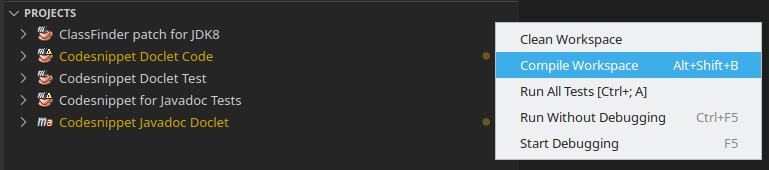

## Debugger and Launch Configurations
Language Server __Java+ ...__ launch configuration supports debugging and running Java applications using JDK11 or newer. 
1. The launch configuration (debugger) is invoked when `Run main | Debug main` code lense is selected in the code.
2. Or __Java+...__ is selected in __Run and Debug__ activity panel.
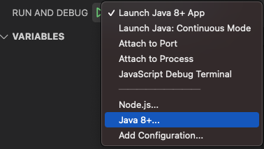
### Launch Configurations
* __Launch Java App__ - Debug or Run current Java project
* __Launch Java: Continuous Mode__ - Runs Micronaut project and reloads it when source code has been changed.
* __Attach to Port__ & __Attach to Process__ - Attach debugger actions. Available when __Java+ ...__ at the bottom of drop down list is selected.
    * Select this configuration, then click the  
    * Select either from available process or enter the port to connect to JVM running with JDWP.
    * __Attach to Shared Memory__ is available on Windows in addtion to above mentioned _Attach..._

Default launch configurations provided by Language Server can modified in `launch.json` file using intellisense for available options.

### Run Configurations panel
Program arguments, VM options, evironment variables,... can be set in Run Configuration panel a part of Explorer. The panel is sufficient for all typical use-cases Java programmer faces. Only advanced, expert scenarios may require touching of `launch.json` (which still takes precedence).

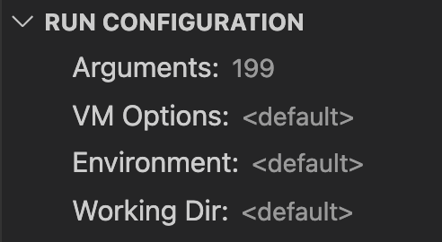 

## Supported Refactorings

Class level refactorings as well as variable refactorings are supported in VSCode via Apache NetBeans extension. See following screenshots:

### Source Action ... context menu
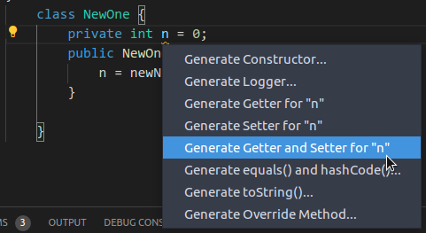 

### Introduce refactorings available via Show Code actions light bulb
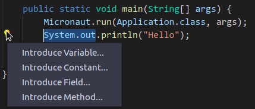

### More Refactorings available also using Refactor... context menu
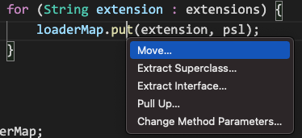

### Surroung with refactorings
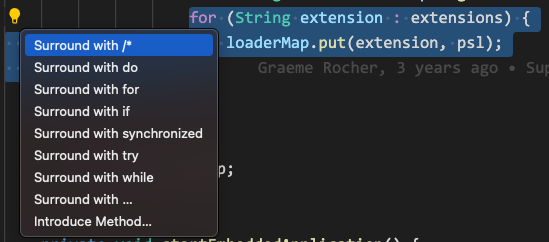

Some refactorings are two steps with like Override method ... where method to be overriden is selected in 2nd step:

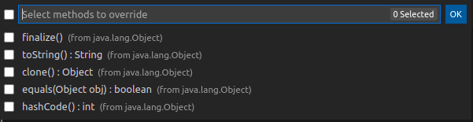

### Change Method Parameters refactoring
Change method parameters refactoring is provided using dedidacated form allowing to change, add, move, remove method parameters.
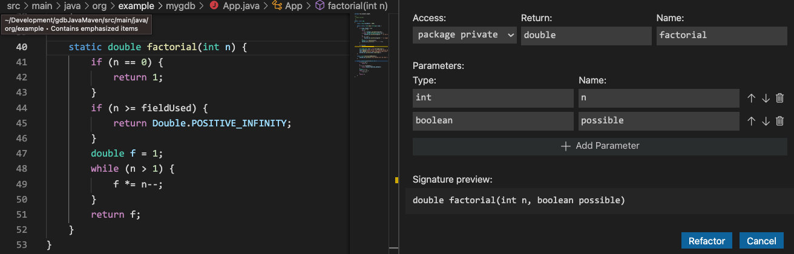

### Move Members Refactoring
Move members refactoring provides dedicated form as well.
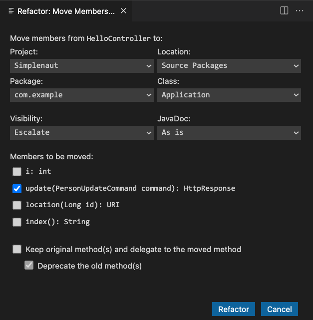

### Some of supported refactorings:
* Convert to static import 
* Rename 	
* Pull member up & down 
* Move class 
* Extract interface/method 
* Extract local variable
* Assign to variable
* Generate hashCode/equals
* Generate toString()
* Surround With refactoring
* For cycle refactoring
* try-catch refactoring
* switch() statement
* while() cycle
* Inline redundant variable 
* Constructor and method argument refactoring

## Organize Imports
Out of the box support for organizing imports in Java sources is available. It removes unused imports, groups imports by packages and updates your imports whenever a file is saved. In addition to the defaults, there is a rich set of configuration options. 

Go to VSCode `Preferences | Settings`  and search for _NetBeans_ to set `Netbeans > Java > Imports:` options:
* `Count For Using Star Import` - Class count to use a star-import, 999 means any number 
* `Count For Using Static Star Import` - Members count to use a static star-import, 999 means any number
* `Groups` - Groups of import statements (specified by their package prefixes) and their sorting order. Import statements within a group are ordered alphabetically

And `Netbeans > Java > On Save: Organize Imports` - Enable organize imports action on a document save

## JavaDoc smart editing
When adding JavaDoc to code NetBeans assists by suggesting to insert preformatted and prepopulated JavaDoc comment. Type `/**` above method signature and IDE offers to complete the JavaDoc. The action creates JavaDoc comment with all arguments prepared.
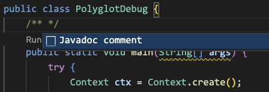

## Source Code formatting
Formatting source code is possible using also other styles than NetBeans. Eclipse, Google and Spring formatters can be used. For Eclipse formatter simply export settings from Eclipse IDE into standard file and then set `Netbeans > Format: Settings Path:` in VSCode Settings.
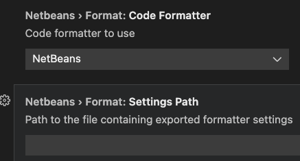 
## Test Explorer
NetBeans Language Server provides Test Explorer view which allows to run all tests in a project, examine the results, go to source code and  run particular test.
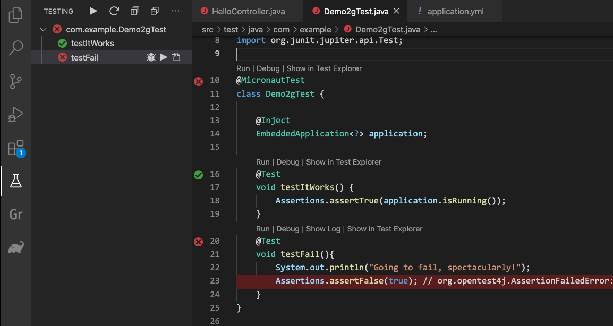


## Native Image Debugger

NetBeans Language Server allows Java like debugging of native images produced by GraalVM native-image tool. It is provided using GDB and via new Run configuration named __Launch Native Image__. This experimental feature works __now__ only on Linux with certain version of GDB, see above.

In order to debug native image applications it is necessary to build such native image with debug information available. It can be done by providing following switches for native-image tool: 
- `-g -O0` or 
- `-H:Debug=2 -H:Optimize=0`. 

### Using Native Image Maven Plugin
It is possible to use [Native-Image Maven Plugin](https://www.graalvm.org/reference-manual/native-image/NativeImageMavenPlugin/) to run native-image builds for Maven projects. 
In this case add following `<buildArgs>` into plugin `<configuration>`:
```
<buildArgs>
  <buildArg>-g</buildArg>
  <buildArg>-O0</buildArg>
</buildArgs>
```
Setting project's Maven pom.xml to skip native-image build everytime when project is being built is a good practice.

When native image is built, including debug info then add __Launch Native Image__ configuration to launch.json. Select it in Run & Debug activity window and press F5 to debug Java source code on native image.

## Database Support
Database Explorer allows to connect to databases using appropriate JDBC drivers.
Make Default Connection sets selected Database connection as default for IDE. This connection is then used by all IDE editors for SQL Code completion, or Micronaut Data queries, e.g. `findByPagesGreaterThan`

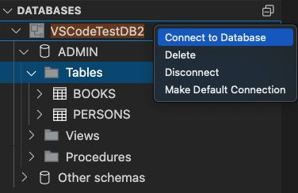

## OCI Explorer
Oracle Cloud Infrastructure Explorer supports viewing compartments and resources available on user OCI instance. It is defined by OCI config file which has to be downloaded according to [OCI instructions](https://docs.oracle.com/en-us/iaas/Content/API/Concepts/sdkconfig.htm) and saved in `<users_home>/.oci/config`

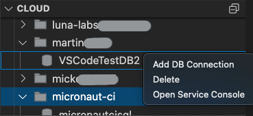

It is possible to add JDBC connection to Oracle Autonomous DB running in OCI using __Add DB Connection__ menu. It downloads DB Wallet automatically.
## Supported Options

* __netbeans.jdkhome__ - path to the JDK, see dedicated section below
* __netbeans.verbose__ - enables verbose extension logging
* __netbeans.conflict.check__ - avoid conflicts with other Java extensions, see below

## Selecting the JDK

The user projects are built, run and debugged using the same JDK which runs the
Apache NetBeans Language Server. The JDK is being searched in
following locations:

- `netbeans.jdkhome` setting (workspace then user settings)
- `java.home` setting (workspace then user settings)
- `JDK_HOME` environment variable
- `JAVA_HOME` environment variable
- current system path

As soon as one of the settings is changed, the Language Server is restarted.

## Running Language Server per VSCode workspace or for user
It is possible to run Apache NetBeans Language Server per workspace (VSCode window). This allows separation of Language Server for given project as Language Server JVM is not shared for more VSCode open workspaces (projects).
It is possible to change this in `Preferences | Settings | Netbeans: Userdir`. Set to `local` to use dedicated Language Server per workspace or set to `global` (this is default) to have one Language Server for all VSCode workspaces.

## Conflicts with other Java Extensions

Apache NetBeans Language Server extension isn't the only Java supporting
extension. To avoid duplicated code completion and other misleading clashes
the extension disables certain functionality known to cause problems, this is done per __Workspace__. 

This behavior can be disabled by setting `netbeans.conflict.check` setting to `false`.

## Contributing

Read [building instructions](BUILD.md) to help Apache community to
improve the extension.

